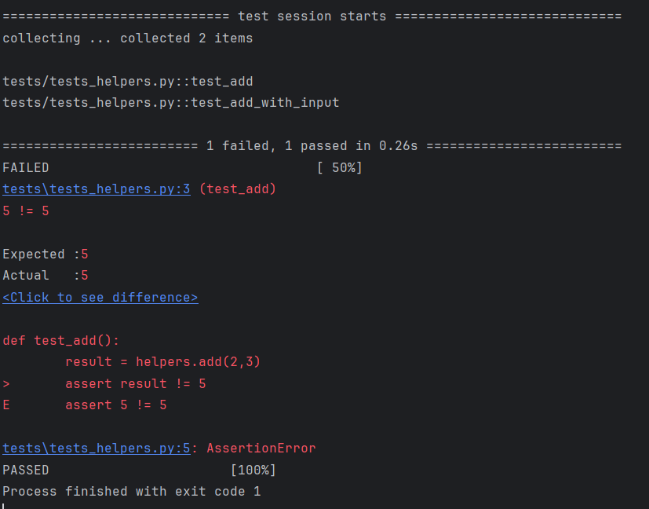

# Lesson 12 - Unit Tests and Pytest

## Overview

This lesson introduces unit testing using **pytest**, a popular Python testing framework. You will learn how to structure tests, write assertions, run tests, and fix failures correctly.

---

## Installing Pytest (do this in your terminal)

Pytest must be installed using your system terminal, not inside a Python file.

* `pip install pytest`: Installs pytest.
* This command is run in your terminal.
* You only need to install it once per environment.

```bash
pip install pytest
```

---

## Setting Up Tests

Unit tests are usually placed inside a separate folder and follow a specific naming pattern.

---

### Creating a `tests` Directory

Tests are typically stored inside a folder named `tests`.

* Create a folder named `tests`.
* Place all test files inside this directory.
* Keeps your project organized.

File structure example:

```
project_folder/
│
├── main.py
├── helpers.py
└── tests/
    └── test_helpers.py
```

---

### Naming Test Files with `tests_`

Test files must start with `test_` so pytest can automatically discover them.

* Pytest looks for files beginning with `test_`.
* Example: `test_helpers.py`.
* If not named correctly, pytest will not run them.

File structure:

```
project_folder/
│
├── helpers.py
└── tests/
    ├── test_helpers.py
    └── test_main.py
```

---

### Import Functions From Your Files to Test

You must import the functions you want to test.

* Import from your project file.
* Use standard Python import syntax.
* Tests live in a separate file.

```python
# helpers.py

def add(a, b):
    return a + b
```

```python
# tests/test_helpers.py

# Import the function to test
from helpers import add

def test_add():
    assert add(2, 3) == 5
```

---

### Create Test Functions with `assert`

Test functions must begin with `test_` and use `assert`.

* Test function names must start with `test_`.
* `assert` checks if something is true.
* If false, pytest reports a failure.

```python
# helpers.py

def multiply(a, b):
    return a * b
```

```python
# tests/test_helpers.py

from helpers import multiply

def test_multiply():
    assert multiply(3, 4) == 12
```

---

### Testing Decimal Values with `approx`

Floating-point math can have small rounding differences.

* Use `pytest.approx()` for decimals.
* Prevents failure due to tiny precision errors.
* Common when dividing numbers.

```python
# helpers.py

def divide(a, b):
    return a / b
```

```python
# tests/test_helpers.py

import pytest
from helpers import divide

def test_divide():
    assert divide(5, 2) == pytest.approx(2.5)
```

---

## Running Tests

Tests are run from your terminal or IDE.

---

### Running Tests From Test File (PyCharm)

In PyCharm:

* Right-click the test file.
* Click **Run 'pytest in test_file'**.
* Results appear in the test panel.

File structure reminder:

```
project_folder/
│
├── helpers.py
└── tests/
    └── test_helpers.py
```

---

### Reading Test Data

When tests run, pytest shows:

* Detailed failure information
* Expected vs actual result

Example terminal output:



* Left side is actual result.
* Right side is expected result.
* Helps you determine what is wrong.

---

## Fixing Tests

When a test fails, the problem is usually one of two things:

1. The function is wrong.
2. The test is wrong.

You must determine which one.

---

### Fixing the Functions Being Tested

If the function contains a bug, fix the function.

Example of a broken function:

```python
# helpers.py

def add(a, b):
    return a - b  # BUG: subtracting instead of adding
```

Test:

```python
# tests/test_helpers.py

from helpers import add

def test_add():
    assert add(2, 3) == 5
```

Failure output:

```bash
E       assert -1 == 5
```

How to debug:

* The test expects 5.
* The function returned -1.
* The logic is incorrect.

Fix the function:

```python
# helpers.py

def add(a, b):
    return a + b
```

Run tests again → should pass.

---

### Fixing the Test Functions Themselves

Sometimes the function is correct but the test is wrong.

Correct function:

```python
# helpers.py

def multiply(a, b):
    return a * b
```

Incorrect test:

```python
# tests/test_helpers.py

from helpers import multiply

def test_multiply():
    assert multiply(3, 4) == 7  # WRONG expected value
```

Failure output:

```bash
E       assert 12 == 7
```

How to debug:

* Check the function manually.
* `3 * 4` equals 12.
* The function is correct.
* The test expectation is wrong.

Fix the test:

```python
def test_multiply():
    assert multiply(3, 4) == 12
```

---

### How to Decide What to Fix

When a test fails:

1. Manually calculate the expected result.
2. Print the function result separately.
3. Check if the function logic is correct.
4. Verify the test’s expected value.

Ask yourself:

* Is the math wrong in the function?
* Or is the expected value wrong in the test?

Never blindly change tests just to make them pass.
Tests should verify correct behavior — not hide bugs.

---

Unit testing is about confidence. When all tests pass, you know your code behaves exactly as expected.


